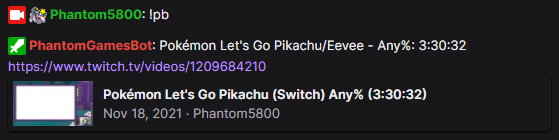
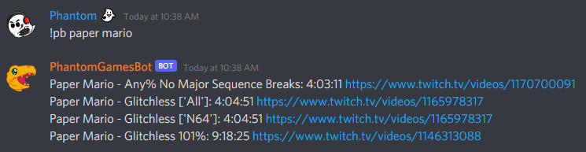
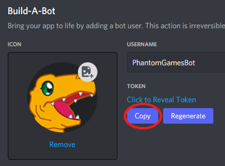

# PhantomGamesBot
This is a Twitch and Discord chatbot used by https://twitch.tv/Phantom5800, written in python and fairly easy to edit and run.

## License

This project is licensed under MIT, see [License](LICENSE) for more details. While it is not required, it would be greatly appreciated for any forks to create pull requests back into the original repository. New features and optimizations are always welcome.

## Setup

1. Install Python 3.7+
2. Create a `.env` file (descripted below)
3. From a command line:
    * If you installed a version of Python that is not 3.9: `set PYVER=3.7`
    * `setup.bat`
    * `run.bat`

### Shortcuts
In Windows, it is possible to create a shortcut to the `run.bat` file and pin that to the start menu or task bar with a bit of effort.

1. Right click on `run.bat` and select `Create shortcut`
2. Right click on the new shortcut and change the target to `C:\Windows\System32\cmd.exe /c "C:\{path to bat file}\run.bat"`
3. Right click on the shortcut again and `Pin to Start`

## Env
At the root, anyone trying to run this will need a `.env` file that looks something like this:

```
TWITCH_OAUTH_TOKEN={OAUTH Token for bot account}
TWITCH_CLIENT_ID={Twitch Client ID}
BOT_NICK={Bot Account Name}
TWITCH_CHANNEL={Channel Name}
TIMER_CHAT_LINES=
TIMER_MINUTES=

BOT_PREFIX=!

SRC_USER={Speedrun.com username}

DISCORD_TOKEN={Discord bot Token}
DISCORD_ROLE_MESSAGE_ID={ID of message containing reaction roles}
```

In order to fill out the `.env`, you'll need to register as a [Twitch developer](https://dev.twitch.tv/console/apps/create) and create an application, this will get you a client id. Then [generate an oauth token](https://twitchapps.com/tmi/) and you'll be good to go for running the bot locally.

# Spam Protection

## Link Protection
The bot will automatically delete messages containing links from users that are not moderators, vips, or subscribers.

# Default Commands
Default command set that can be used by anyone.

### !anime  
Recommends a random anime to a user.

### !animeinfo 
Gives an embedded block of info on a given anime.

### !bot  
Provides a link to the github page for this bot's source code.

### !commands  
Get a list of all available commands the chatbot can reply to. In discord, the list provided only pulls from the custom commands created by moderators on twitch. Default bot commands in discord are provided by `!help`.

### !game 
Display the current game being played.

### !help 
Provides a basic help dialog, giving discord users more detail into what the bot is capable of.

### !pb  
Get the streamer's personal best speedrun time for given game and category. If no category is specified and the streamer has runs in multiple categories, a list will be given instead. The game is taken automatically from twitch.

```
!pb {category}
```



On discord, this command behaves slightly different. Instead of taking a category, it takes a game, and returns all PB's recorded for the given game.

```
!pb {game}
```



### !quote  
Display a random (or specified) quote from the internally stored list.

```
!quote
!quote {quote id}
```

### !speed  

Recommends a random game and speedrun category to a user.

### !title 
Get the current title for the stream.

# Mod Commands
Set of commands that require moderator permissions in the channel in order to use.

### !so 
Give a shoutout to another user, typically would be used for raid's or vip's.

```
!so {username}
```

## Link Protection

### !permit 
Give a specific user permission to post links in chat.

```
!permit {username}
```

### !unpermit 
Remove permissions to post links from a specific user in chat.

```
!unpermit {username}
```

### !disablelinks 
Enable link protection (default on).

### !enablelinks 
Disable link protection. This will stop the bot from scanning message for links and deleting messages. Should only be used if it is being eggregious with false positives.

## Custom Commands
Custom commands are basic command -> response events that can be managed by the streamer and moderators with the following commands. All commands created in this way are available on both Twitch and Discord, however some command variables may not function as intended on both platforms.

### !addcommand 
Add a new custom command to the bot.

```
!addcommand {command} {response text}
```

### !editcommand 
Edit the response for an existing command.

```
!editcommand {command} {response text}
```

### !removecommand 
Remove a custom bot command.

```
!removecommand {command}
```

### !setcooldown 
Set the cooldown on a custom command to restrict how often it can be used.

```
!setcooldown {command} {cooldown in seconds}
```

### Command Variables
These variables can be used in custom commands to fill in data dynamically.

#### Twitch-Only Variables 

* `$msg` - Replaced with the contents of the user's message (ignoring the command itself).
* `$randuser` - Mentions a random user in chat.
    * `$randmod` - Mentions a random moderator in chat.
    * `$randsub` - Mentions a random subscriber in chat.
* `$user` - Mentions the chatter that used the command.

#### Shared Variables  

* `$count` - The number of times this command has been called (will not track previous calls if this variable has been added later).
* `$randnum(min,max)` - Generates a random number in the inclusive range [min,max].

## Quotes

### !addquote 
Add a new quote to the list, current game and date are automatically added.

```
!addquote {new quote}
```

### !editquote 
Edit an existing quote in case of typos, etc.

```
!editquote {quote id} {quote text}
```

### !removequote 
Remove an existing quote, all quotes that appear after are shifted down accordingly so the ID sequence is never broken.

```
!removequote {quote id}
```

## Timer Events

Timer events are posted automatically at given intervals set by `TIMER_MINUTES` and `TIMER_CHAT_LINES` in `.env`. If a timer triggers and the required amount of chat messages have not passed, the timer will wait the full duration before checking again. This may need to be tweaked based on the streamer's chat and what they expect. In some cases it may be better to have shorter timers with a higher message requirement. Experimenting with the numbers is highly recommended.

### !disabletimer 
Disable all bot timer messages.

### !enabletimer 
Enable bot timer messages.

### !addtimer 
Add a custom command to the timer queue.

```
!addtimer {command}
```

### !removetimer 
Removes a command from the timer queue.

```
!removetimer {command}
```

### !timerevents 
Get a list of all the current events added to the timer.

# Discord Settings
PhantomGamesBot supports discord as well. The only setup required is to create an application in the [Discord Developer Portal](https://discord.com/developers/applications) and copy the token for the bot into `.env`. Other settings in the portal depend entirely on what you would be using the bot for.



## Role Reactions
The bot currently supports role assignment through emote reactions. The emotes and roles themselves are located in [frontend/data/discord_emoji_roles.json](./frontend/data/discord_emoji_roles.json). The emoji is fairly straight forward, acting as a key for an id that is bound to a role. In discord, you can enable developer mode in advanced user settings, then right click on any role in a server you control and select `Copy ID`, this will be what is placed in the json file. Do the same for `DISCORD_ROLE_MESSAGE_ID` in `.env` so that the bot knows which chat message to watch reactions for, and that's all there is to it.